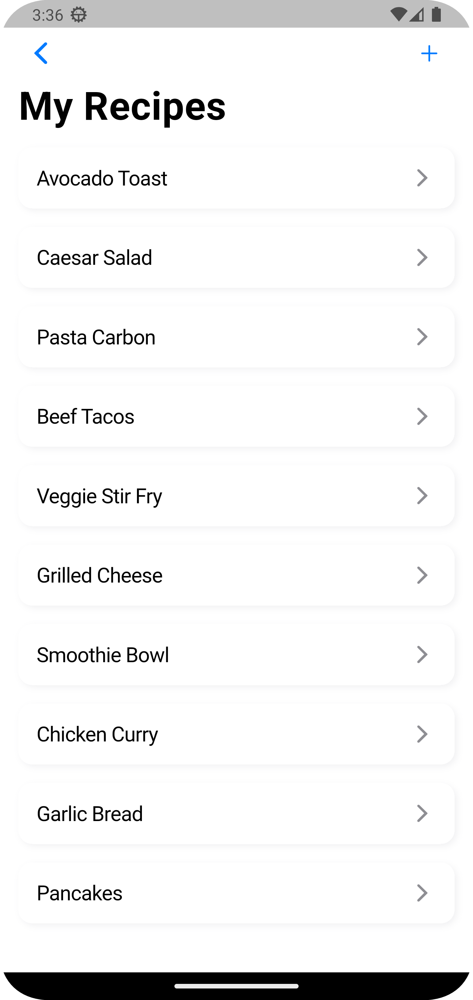

# Cupertino Sliver Navigation Demo

This is a Flutter demo showcasing the `CupertinoSliverNavigationBar` widget in a real-world use case: a simple recipe list app with iOS-style UI.

##  How to Run

1. Clone the repo  
2. Run these commands in your project directory:

```bash
flutter pub get
flutter run


Widget Used
Widget: CupertinoSliverNavigationBar
It creates a large-title, scrollable navigation bar styled like iOS.

 3 Attributes Demonstrated
largeTitle – Displays a large, prominent title at the top (My Recipes)

backgroundColor – Sets the background color of the navigation bar (CupertinoColors.systemGrey6)

leading – Adds a back button using CupertinoNavigationBarBackButton

##  Screenshot


